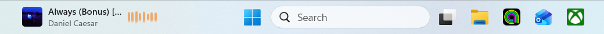
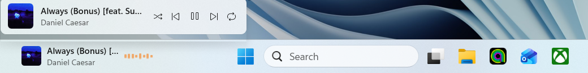

# Flyout Taskbar

Now playing, inside the Windows 11 taskbar.

Album artwork, the track, the artist and a waveform that animates only while
something is actually playing. Clicking the strip opens a player popover with
previous / play-pause / next, shuffle and repeat.

It reads the Windows System Media Transport Controls, so it follows Spotify, a
YouTube tab in a browser, or anything else that publishes a media session — no
per-app setup.

The strip is a real child of the taskbar's own XAML tree, not a window floating
over it. Windows 11 removed deskbands and offers no supported API for putting
content in the taskbar, so a [Windhawk](https://windhawk.net/) mod is the only
way to be genuinely *inside* it.

## Install

1. Install [Windhawk](https://windhawk.net/) — a normal Windows installer, once.
2. Open Windhawk and go to **Explore**.
3. Search for **Fluent Music in the taskbar** and press **Install**.

Windhawk compiles the mod locally and keeps it updated. Uninstalling is one
click and leaves the taskbar exactly as it was.

Until the mod is listed, install it by hand instead: in Windhawk choose
*Create a new mod*, paste
[`windhawk/fluent-music-taskbar.wh.cpp`](windhawk/fluent-music-taskbar.wh.cpp)
over the template, and press **Compile**.

## Settings

In Windhawk, under the mod's **Settings** tab:

* **Distance from the left** moves the strip along the taskbar. The default sits
  it in the empty run between the widgets button and the centred Start icons; if
  your taskbar is arranged differently, change this rather than reinstalling.
* Album artwork, the popover controls and the waveform can each be turned off.

## Compatibility

Developed and tested on Windows 11 25H2 (build 26200). It hooks
`TaskbarFrame::OnTaskbarLayoutChildBoundsChanged` in `Taskbar.View.dll`; if that
symbol is absent on your build, the mod logs a failure and does nothing rather
than misbehaving.

MIT licensed.

## `tools/SmtcProbe/`

A small console probe that dumps whatever the media session currently reports —
title, artist, playback state, thumbnail bytes. Useful for telling "the app
isn't publishing artwork" apart from "our code isn't showing it".
